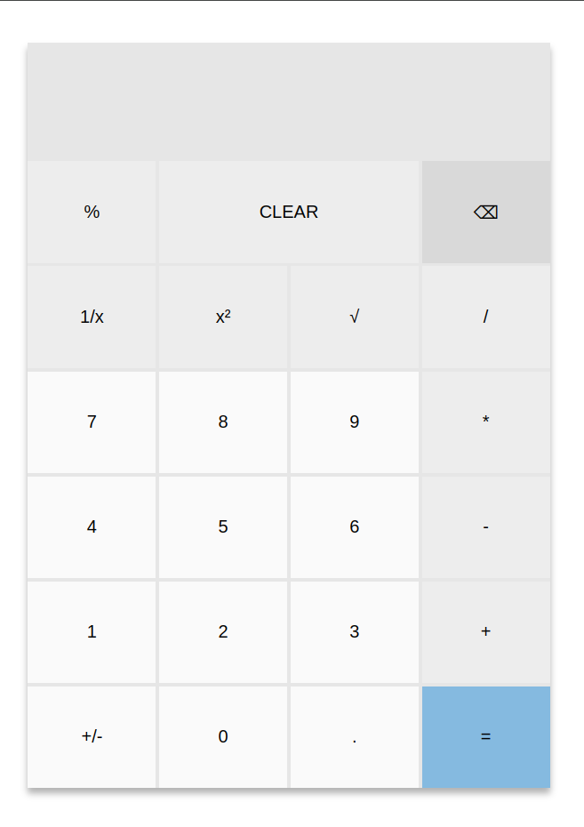
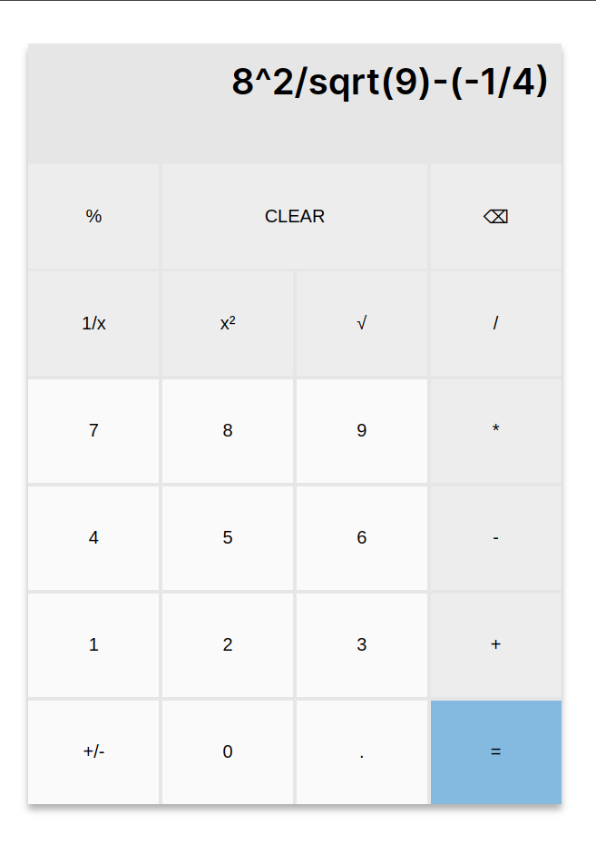
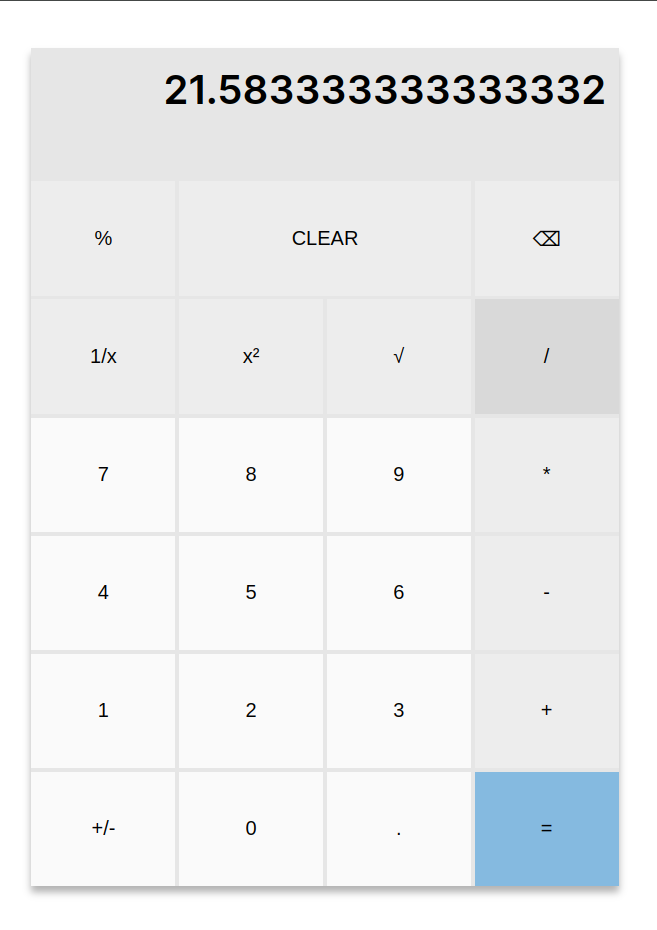
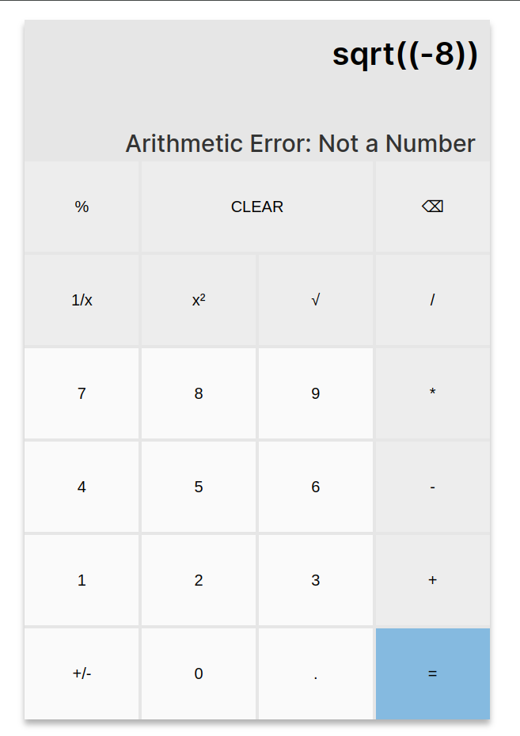
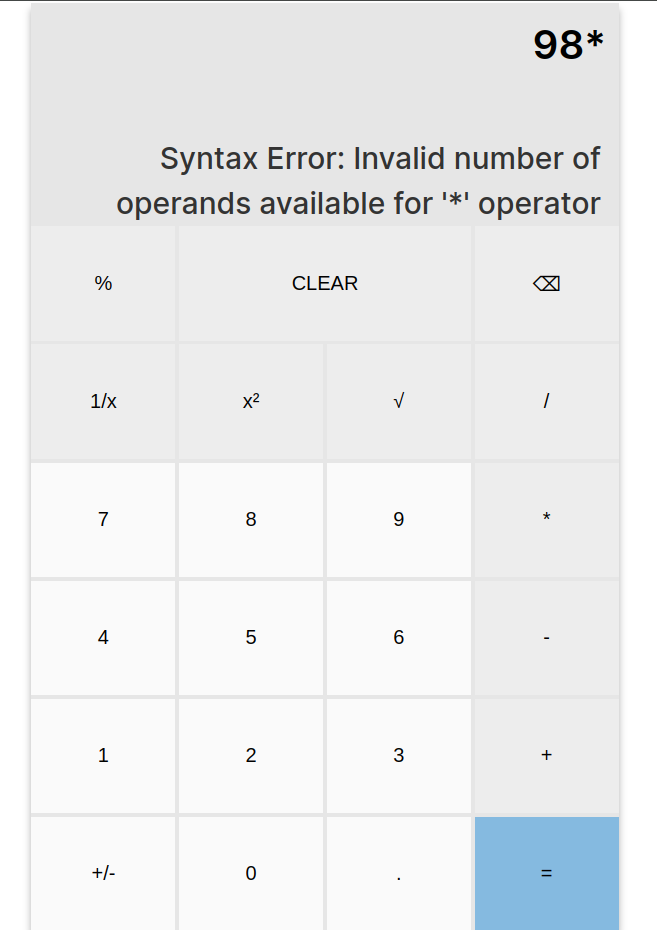
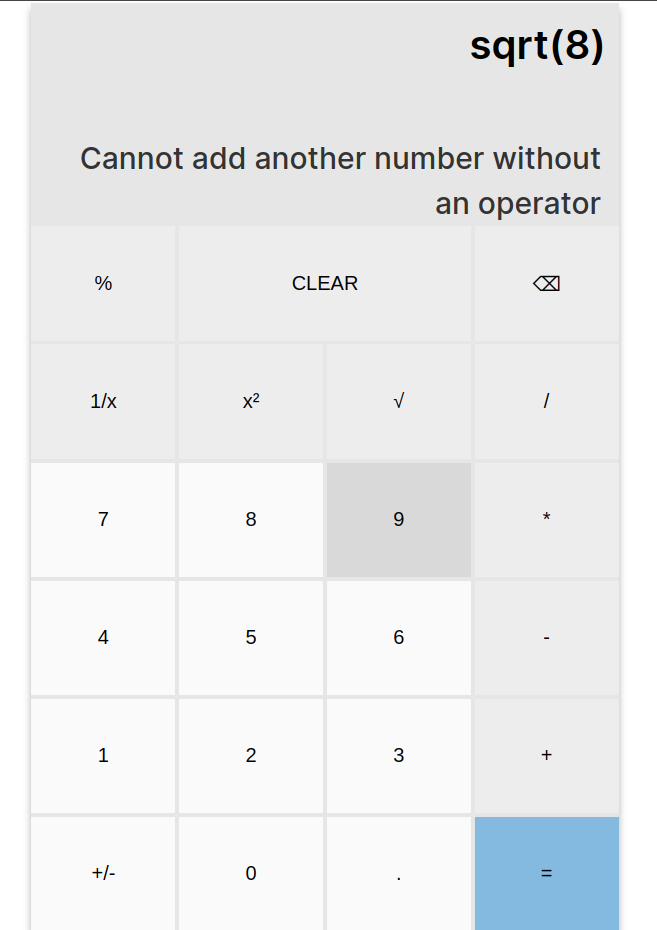
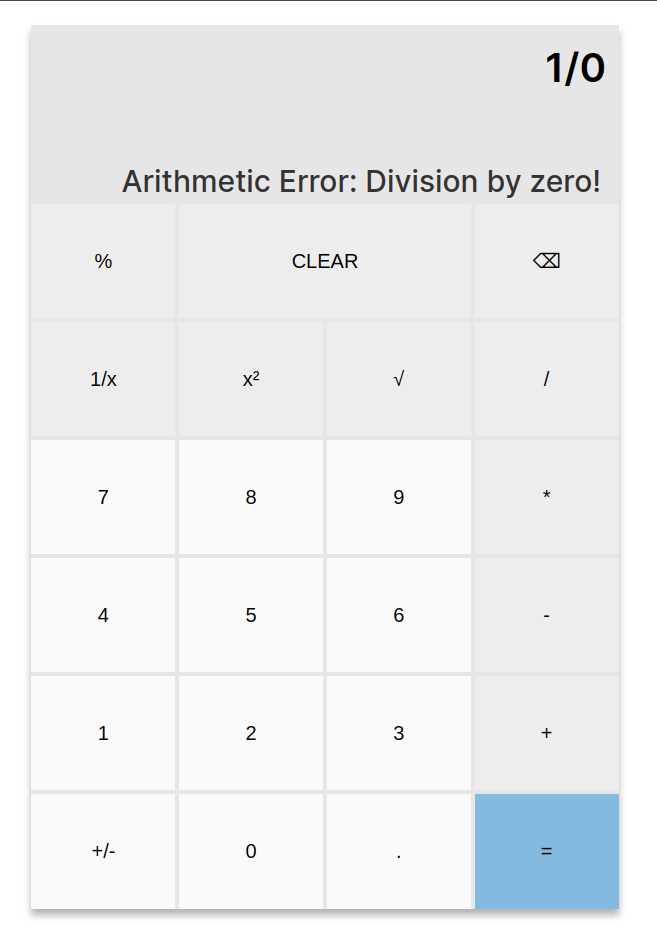

# Microsoft Calculator Clone

A web-based calculator inspired by the Microsoft Calculator, built with **React** for the frontend and **Spring Boot** for the backend. The calculator supports basic arithmetic operations and evaluates expressions on the server side.

## Features

- **Basic Calculator Functions:** Supports addition, subtraction, multiplication, and division.
- **Server-Side Calculation:** All calculations are processed by the backend to ensure consistency.
- **Error Handling:** Handles division by zero and syntax errors in expressions.
- **Responsive UI:** Styled to resemble the Microsoft Calculator, without advanced styling.

## Tech Stack

- **Frontend**: React with Vite
- **Backend**: Spring Boot
  - **Library for Evaluation:** [**exp4j**](https://www.objecthunter.net/exp4j/) for evaluating mathematical expressions

## Assumptions

1. **Unary Operators**: The operations `sqrt`, `x^2`, and `1/x` apply only to the last number in the input.
2. **Backspace Functionality**: The backspace (delete) button removes the last character in the input. It operates logically and sequentially, aiming to maintain the intended expression without disrupting the calculation flow.
3. **Division by Zero**: Any division by zero will return an error message.
4. **Error Messages**: Errors such as syntax errors or unsupported operations will display a custom error message to improve the user experience.
5. **Operator Repetition**: Repeating the `=` button does not reissue the calculation.

## Screenshots

<div style="display: flex; flex-wrap: wrap;">
    
    
    
</div>
<div style="display: flex; flex-wrap: wrap;">
    
    
    
    
</div>

## Getting Started

### Prerequisites

- **Node.js** (for the frontend)
- **Java 11 or higher** (for the backend)
- [**Postman**](https://www.postman.com/) (optional, for testing API separately)

### Installation

#### 1. Clone the Repository

```bash
git clone https://github.com/HuzaifaOmar/windows-calculator-clone
cd windows-calculator-clone
```

#### 2. Backend Setup

1. Navigate to the backend folder.
2. Import the project into IntelliJ or run with Maven:

    ```bash
    mvn spring-boot:run
    ```

3. Ensure the server is running on <http://localhost:8080>.

#### 3. Frontend Setup

1. Navigate to the frontend folder.
2. Install dependencies:

    ```bash
    npm install
    ```

3. Start the frontend server:

    ```bash
    npm run dev
    ```

### Usage

1. **Visit the URL that shows up in your terminal after running `npm run dev` to view the calculator in your browser** (it should be something like <http://localhost:XXXX/>).
2. **Enter an expression** using the on-screen buttons.
3. **Press "="** to send the calculation request to the backend.
4. **View the result** on the calculator’s display. Errors (e.g., dividing by zero) will show as "Error".
